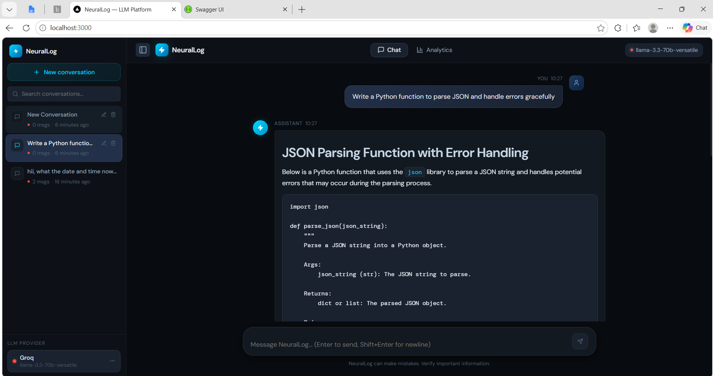
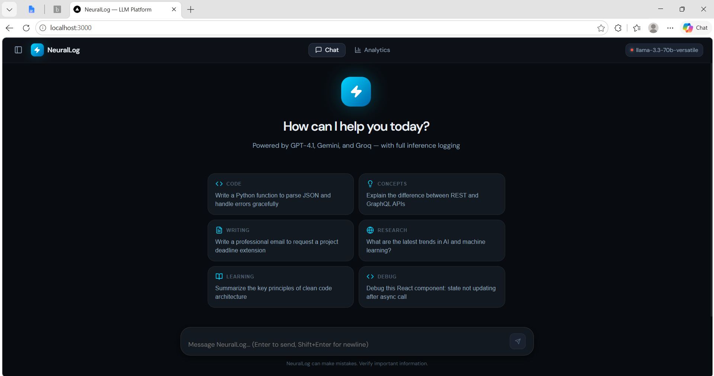
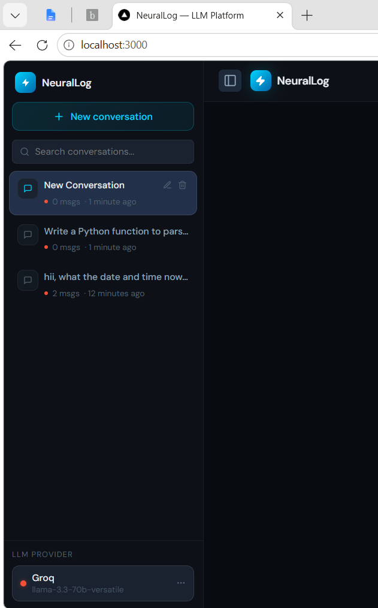
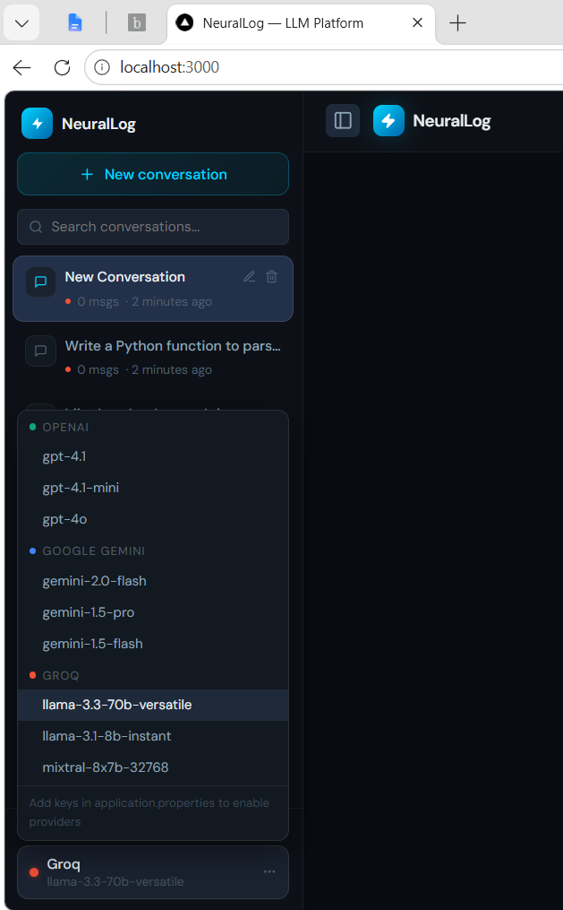
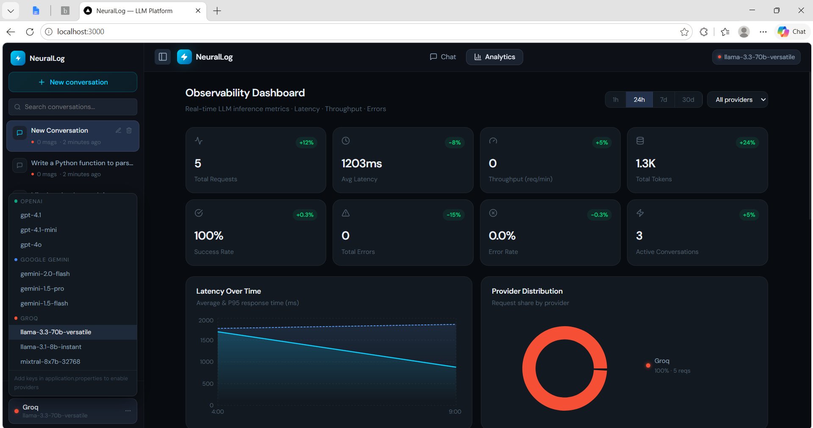
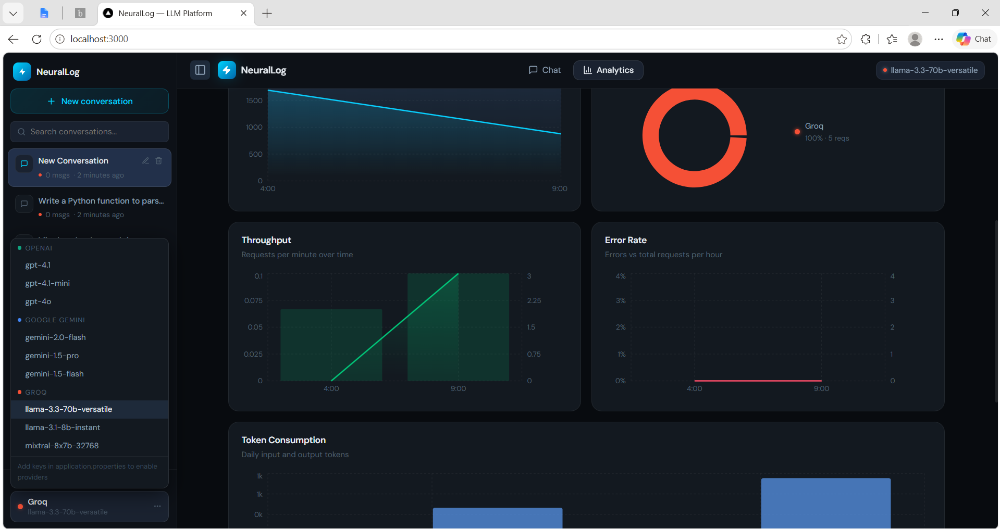
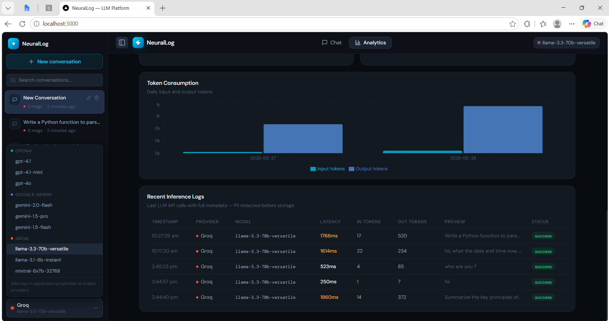
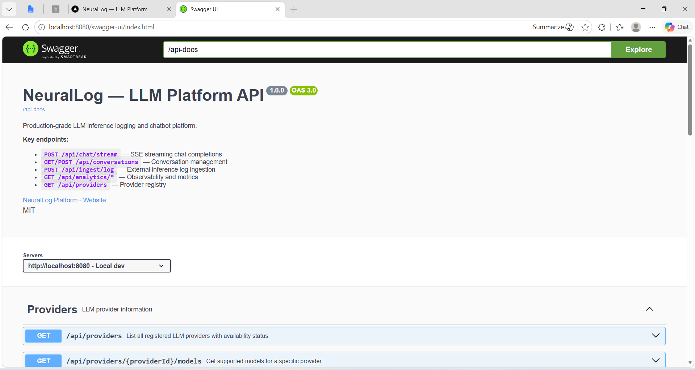

# ⚡ NeuralLog — LLM Inference Logging & Chatbot Platform

A production-grade, full-stack platform for multi-provider LLM chat with complete inference observability. Built with React 18, Spring Boot 3.2, MySQL 8, and Docker.

---

## 📸 Screenshots

### Chat Interface



---

### Welcome Screen



---

### Conversation Sidebar — Multi-turn & Resume



---

### Provider Selector



---

### Analytics Dashboard — Overview



---

### Analytics Dashboard — Charts



---

### Inference Logs Table



---

### Swagger API Docs



---

## ✨ Features

| Feature                     | Detail                                                                        |
| --------------------------- | ----------------------------------------------------------------------------- |
| **Multi-turn Chat**         | Persistent conversations with full context window (last 20 messages)          |
| **Streaming Responses**     | Real-time token streaming via Server-Sent Events (SSE)                        |
| **Multi-provider**          | OpenAI GPT-4.1, Google Gemini, Groq — switchable per conversation             |
| **Cancel Generation**       | Stop mid-stream with a single click                                           |
| **Conversation History**    | Resume, rename, delete any past conversation                                  |
| **Inference Logging**       | Every API call logged: latency, tokens, provider, status, timestamps          |
| **Lightweight SDK Wrapper** | `LlmSdkWrapper` captures all metadata, ships logs async to ingestion pipeline |
| **Ingestion Pipeline**      | Validate → Redact PII → Extract metadata → Persist to MySQL                   |
| **PII Redaction**           | Emails, phone numbers, credit cards auto-redacted before storage              |
| **Analytics Dashboard**     | Latency, Throughput, Error Rate, Token consumption, Provider breakdown        |
| **Event-based Ingestion**   | `@Async` decoupled ingestion — zero latency impact on streaming               |
| **Swagger / OpenAPI**       | Full API docs at `/swagger-ui.html`                                           |
| **Docker Compose**          | One-command startup: `docker compose up --build`                              |
| **Kubernetes**              | Complete K8s manifests with HPA, Ingress, PVC, Secrets                        |

---

## 🚀 Quick Start

### Prerequisites

* Docker & Docker Compose v2+
* API key from at least one provider (OpenAI, Gemini, or Groq)

### 1. Clone & configure

```bash
git clone https://github.com/ChinthaVamsidharReddy/neurallog.git
cd neurallog

cp .env.example .env
# Open .env and add your API key(s)
```

### 2. Start everything with one command

```bash
docker compose up --build
```

| Service     | URL                                   |
| ----------- | ------------------------------------- |
| Frontend    | http://localhost:3000                 |
| Backend API | http://localhost:8080                 |
| Swagger UI  | http://localhost:8080/swagger-ui.html |
| MySQL       | localhost:3306                        |

### 3. Local development (without Docker)

**Start only MySQL via Docker:**

```bash
docker compose up mysql -d
```

**Run backend:**

```bash
cd backend
./mvnw clean spring-boot:run
# Keys can also be passed inline:
# ./mvnw spring-boot:run -Dspring-boot.run.systemProperties="groq.api.key=gsk_..."
```

**Run frontend:**

```bash
cd frontend
npm install
npm start
# Proxies /api/* to http://localhost:8080 automatically
```

---

## 🗂 Project Structure

```text
neurallog/
├── docker-compose.yml
├── .env.example
├── docs/
│   └── screenshots/
├── docker/
│   └── mysql-init.sql
├── k8s/
│   ├── namespace.yaml
│   ├── configmap.yaml
│   ├── secret.yaml
│   ├── mysql-pvc.yaml
│   ├── mysql-deployment.yaml
│   ├── backend-deployment.yaml
│   ├── frontend-deployment.yaml
│   ├── ingress.yaml
│   ├── hpa.yaml
│   └── README.md
│
├── frontend/
│   ├── Dockerfile
│   ├── nginx.conf
│   └── src/
│       ├── App.js
│       ├── contexts/AppContext.js
│       ├── services/api.js
│       └── components/
│           ├── layout/
│           ├── sidebar/
│           ├── chat/
│           └── analytics/
│
└── backend/
    ├── Dockerfile
    └── src/main/java/com/llmplatform/
        ├── LlmPlatformApplication.java
        ├── config/
        ├── controller/
        ├── service/
        ├── sdk/
        ├── provider/
        ├── ingestion/
        ├── entity/
        ├── repository/
        └── middleware/
```

---

## 🏛 Architecture Overview

```text
┌──────────────────────────────────────────────────────────────┐
│ Browser (React 18 SPA)                                      │
└──────────────────────────────────────────────────────────────┘
                │
                ▼
┌──────────────────────────────────────────────────────────────┐
│ Spring Boot 3.2 Backend                                     │
└──────────────────────────────────────────────────────────────┘
                │
                ▼
┌──────────────────────────────────────────────────────────────┐
│ MySQL 8.x                                                   │
└──────────────────────────────────────────────────────────────┘
```

---

## 🔌 Lightweight SDK Wrapper

`LlmSdkWrapper` is a middleware component that wraps every LLM API call and automatically captures inference metadata without any changes needed in business logic:

```java
sdk.streamWithLogging(
    llmRequest, provider, sessionId, conversationId,
    onChunk, onDone, onError
);
```

### What it captures automatically

| Field               | Description                        |
| ------------------- | ---------------------------------- |
| `provider`          | openai / gemini / groq             |
| `model`             | e.g. llama-3.3-70b-versatile       |
| `requestTimestamp`  | When the call started              |
| `responseTimestamp` | When the last token arrived        |
| `latencyMs`         | End-to-end response time           |
| `inputTokens`       | Estimated from input length        |
| `outputTokens`      | Estimated from output length       |
| `status`            | success / error / timeout          |
| `errorMessage`      | Full error text on failure         |
| `sessionId`         | Browser session identifier         |
| `conversationId`    | Conversation UUID                  |
| `inputPreview`      | First 200 chars of user message    |
| `outputPreview`     | First 200 chars of assistant reply |
| `requestSizeBytes`  | Raw request body size              |
| `responseSizeBytes` | Raw response body size             |

All logs are shipped asynchronously via `IngestionService` — zero latency added to the streaming response.

---

## 📡 Ingestion Pipeline

```text
ChatService / External SDK
        │
        ▼
POST /api/ingest/log → 202 Accepted immediately
        │
        ▼
@Async Spring thread pool (non-blocking)
        │
        ▼
Validate → Redact PII → Extract metadata → Persist to MySQL
```

Batch ingestion is also supported:

```text
POST /api/ingest/batch
```

accepts an array of payloads.

---

## 📊 Logging Strategy

Every LLM call goes through `LlmSdkWrapper` → `IngestionService`.

* Synchronous path (streaming response to user): provider → SSE chunks → client
* Async path (logging): after each call completes, metadata is shipped on a separate thread pool
* Structured logs via SLF4J at DEBUG level
* PII is redacted before any storage
* External ingestion endpoint (`POST /api/ingest/log`) supported

---

## 🗄 Schema Design Decisions

### conversations

* UUID primary key
* `session_id` indexed
* `message_count` and `total_tokens` are denormalized counters
* `updated_at` auto-managed by MySQL

### messages

* Foreign key to conversations with `CASCADE DELETE`
* `LONGTEXT` for content
* `latency_ms` stored per assistant message

### inference_logs

* Decoupled from messages
* `(provider, created_at)` composite index
* `pii_detected` boolean flag
* `input_preview` / `output_preview` capped at 500 chars
* `retry_count` field

---

## 📈 Analytics API

| Endpoint                        | Returns                                                                          |
| ------------------------------- | -------------------------------------------------------------------------------- |
| `GET /api/analytics/summary`    | totalRequests, avgLatencyMs, totalTokens, successRate, errorCount, throughputRpm |
| `GET /api/analytics/latency`    | Hourly avg + P95 latency                                                         |
| `GET /api/analytics/throughput` | Hourly req/min + total count                                                     |
| `GET /api/analytics/errors`     | Hourly error count + error rate                                                  |
| `GET /api/analytics/tokens`     | Daily input/output tokens                                                        |
| `GET /api/analytics/providers`  | Per-provider request share                                                       |
| `GET /api/analytics/logs`       | Recent inference logs                                                            |

---

## 🔌 Provider Abstraction

```java
interface LlmProvider {
    String getProviderId();
    String getProviderName();
    List<String> getSupportedModels();
    void streamChat(LlmRequest, Consumer<String> onChunk,
                    Runnable onDone,
                    Consumer<Exception> onError);
    boolean isAvailable();
}
```

`ProviderRegistry` auto-routes to the first available provider if the requested one has no key.

---

## 📊 Streaming Architecture (SSE vs WebSockets)

| Concern     | SSE (chosen)          | WebSocket                  |
| ----------- | --------------------- | -------------------------- |
| Protocol    | Standard HTTP/1.1     | Separate upgrade handshake |
| Direction   | Server → Client       | Bidirectional              |
| Spring Boot | `SseEmitter` built-in | Extra dependency           |
| Reconnect   | Automatic             | Manual                     |

---

## 🔑 API Key Configuration

| Provider      | Property         |
| ------------- | ---------------- |
| OpenAI        | `openai.api.key` |
| Google Gemini | `gemini.api.key` |
| Groq          | `groq.api.key`   |

---

## 📦 Example API Payloads

### Stream a chat message

```bash
curl -N -X POST "http://localhost:8080/api/chat/stream?provider=groq&model=llama-3.3-70b-versatile&sessionId=s1" \
  -H "Content-Type: application/json" \
  -d '{"message":"Explain database indexing in simple terms"}'
```

### Ingest an external inference log

```bash
curl -X POST http://localhost:8080/api/ingest/log \
  -H "Content-Type: application/json" \
  -d '{
    "provider": "groq",
    "model": "llama-3.3-70b-versatile",
    "sessionId": "ext-session-001",
    "latencyMs": 310,
    "inputTokens": 150,
    "outputTokens": 420,
    "status": "success"
  }'
```

Response:

```text
202 Accepted
```

---

## ⚡ Scaling Considerations

* Backend is fully stateless
* Ingestion throughput handled via `@Async`
* Indexed analytics queries
* Kubernetes HPA scales backend 2→10 pods
* Frontend scales cheaply

---

## 🛡 Failure Handling

| Failure                            | Behaviour                        |
| ---------------------------------- | -------------------------------- |
| Provider API returns 4xx/5xx       | Error SSE chunk + ingestion log  |
| Provider key missing               | Auto-routed                      |
| MySQL unavailable during ingestion | Logged only, response unaffected |
| PII in payload                     | Redacted before storage          |

---

## 🔮 What I Would Improve With More Time

* Kafka / RabbitMQ
* Real token counts
* Prometheus + Grafana
* Rate limiting
* Cost tracking
* JWT authentication
* Conversation search
* Export as Markdown or JSON

---

## 🧑‍💻 Development Notes

### Swagger UI

```text
http://localhost:8080/swagger-ui.html
```

### Adding a new LLM provider

```java
@Component
public class AnthropicProvider implements LlmProvider {

    @Override
    public String getProviderId() {
        return "anthropic";
    }

    @Override
    public boolean isAvailable() {
        return !apiKey.isBlank();
    }
}
```

Spring auto-discovers and registers it in `ProviderRegistry`.

### Clean build

```bash
cd backend && mvn clean spring-boot:run
```

---

## 📄 License

MIT — free for personal projects, portfolio demos, and production deployments.
